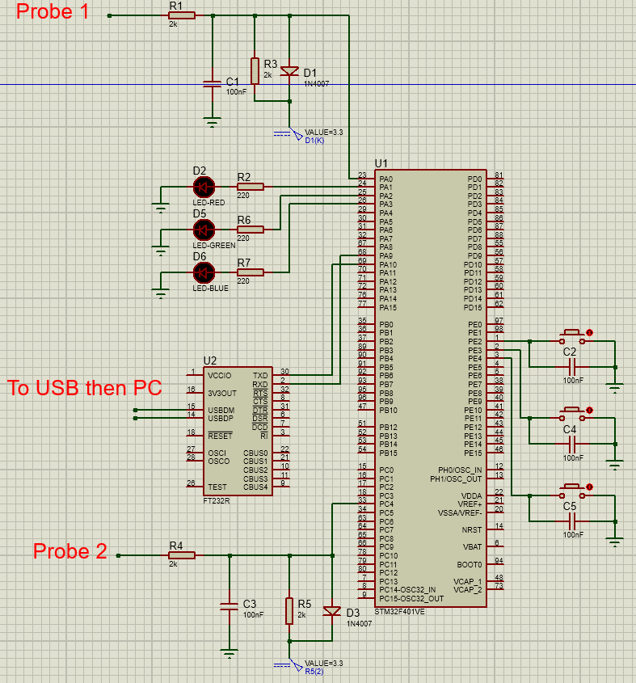

# Real-Time Dual-Channel Digital Oscilloscope (STM32 + C# WinForms)

An end-to-end digital oscilloscope system using a bare-metal STM32 microcontroller for high-speed dual-channel analog acquisition and a custom C# Windows Forms desktop host for real-time visualization, protocol parsing, and signal analysis.

## Key Technical Specifications

* **Sampling Rate:** 10 kHz concurrent sampling via TIM2 timer interrupts and ADC1.
* **Communication Interface:** High-speed USART streaming at **921,600 baud** via FT232R USB-to-UART bridge.
* **Firmware Implementation:** 100% bare-metal C using direct register manipulation (no HAL libraries).
* **Signal Metrics Calculated:** $V_{\text{max}}$, $V_{\text{min}}$, $V_{\text{pp}}$, $V_{\text{rms}}$, and Frequency (via edge timing with clock drift compensation).
* **Desktop GUI:** C# WinForms using double-buffered `ConcurrentQueue` data streaming and optimized `FastLine` chart updates at 30 FPS.
* **Hardware Controls:** Physical push-button debouncing on GPIOE for hardware pause and channel toggle states, synchronized to PC via custom command packets.

## System Architecture & Protocol Design

Data is transmitted in structured byte frames with fixed header bytes and frame-tail validation (`0x55`):

| Frame Type | Header | Payload | Tail | Description |
|---|---|---|---|---|
| **Raw Sample** | `0xAA` | `[CH1_Byte, CH2_Byte]` | `0x55` | Continuous 10 kHz ADC voltage data |
| **Statistics** | `0xBB` | `[Vmax1, Vmin1, Freq1_H, Freq1_L, RMS1_H, RMS1_L, Vmax2, Vmin2, Freq2_H, Freq2_L, RMS2_H, RMS2_L]` | `0x55` | 200ms windowed statistical analysis |
| **Command** | `0xFF` | `[CMD_ID, STATE]` | `0x55` | Hardware state synchronization (Pause / Channel Toggle) |

## Hardware Schematic

### Front-End Input Protection & Conditioning
* Analog inputs are clamped using 1N4007 diodes (`3.3V` upper bound, `-3.3V` lower bound).
* RC low-pass filtering ($R = 2\text{ k}\Omega$, $C = 100\text{ nF}$) cuts high-frequency noise prior to ADC conversion.
* Voltage scaling maps the input signals safely to the `0 - 3.3V` range of the STM32 ADC.

## How to Run
1. Flash the contents of the `Firmware/` folder to your STM32 board using your preferred ARM toolchain.
2. Wire signal inputs to `PA0` (CH1) and `PC4` (CH2) according to the schematic.
3. Open the `PC_GUI/Oscilloscope_STM32_Screen.sln` solution in Visual Studio, build the project, select the active COM port (FT232R), and click **Connect**.